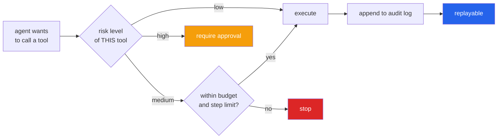
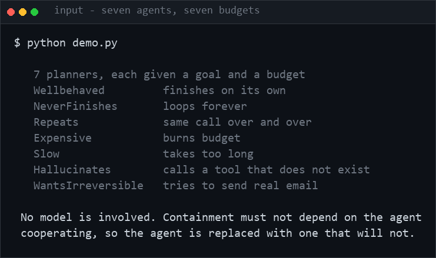
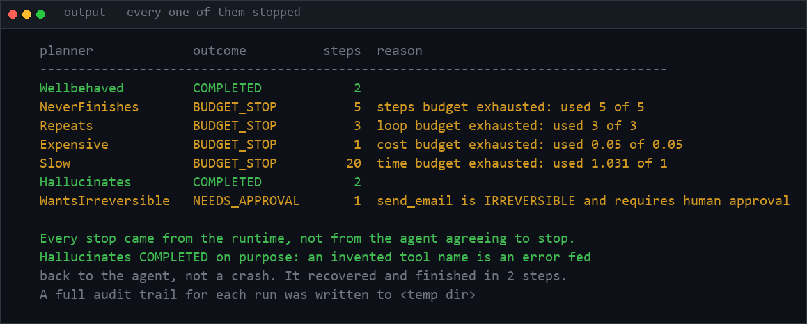

<h1 align="center">bounded-agent-runtime</h1>
<p align="center"><i>Agent limits in the runtime, not in the prompt - and a chaos suite that proves it</i></p>

<p align="center">
  <a href="#the-premise">The premise</a> &middot;
  <a href="#what-is-bounded">What is bounded</a> &middot;
  <a href="#risk-is-a-property-of-the-tool">Risk per tool</a> &middot;
  <a href="#the-chaos-suite-is-the-project">The chaos suite</a> &middot;
  <a href="#audit-and-replay">Audit and replay</a> &middot;
  <a href="#problems-hit-while-building-this">Problems hit</a>
</p>

<p align="center">
  <a href="https://github.com/hammas159/bounded-agent-runtime/actions/workflows/ci.yml"></a>
  
  
  
  <a href="LICENSE"></a>
</p>

---

## The premise



Every job description asks for "safe" or "governed" agents, and almost every implementation
puts the limits **in the prompt**. A prompt is a request. This puts them in the runtime,
then tries to break it on every push.


An agent cannot be trusted to respect its own limits, because the thing being limited
is the thing doing the checking. So:

- every ceiling lives **outside** the agent loop
- it is checked **before** each step, not after
- it **raises** rather than returns — a returned error can be ignored by a caller,
  an exception unwinds the loop whether it wants to or not

```python
while True:
    budget.check()                    # before the step, so nothing runs over budget
    action = planner.next_action(...)  # a model, or a script
    budget.record_step(fingerprint)    # counts, and detects repetition
    result = registry.call(...)        # may raise ToolError or ApprovalRequired
```

## What is bounded

| Ceiling | Stops |
|---|---|
| `max_steps` | an agent that never emits `finish` |
| `max_seconds` | a hanging dependency |
| `max_usd` | steps that are individually cheap and collectively not |
| `max_tool_calls` | fan-out |
| `max_repeats` | **loop detection** — exact repetition of an action fingerprint |

Loop detection compares exact repetition rather than similarity. It is cheap, has no
false positives worth worrying about, and catches the failure that actually happens:
an agent re-issuing an identical call because the observation did not change. An
agent alternating between two actions is *not* flagged — that is a test.

Per-run `Budget` and per-tenant `Quota` are separate, on purpose. Without the second,
a caller exhausts a shared system by starting many individually well-behaved runs —
which is the failure that shows up in production.

## Risk is a property of the tool

Not a judgement the agent makes about its own plan. A tool declares its tier when it
is registered:

| Tier | Meaning |
|---|---|
| `READ` | observes; changes nothing |
| `WRITE` | changes state, reversibly |
| `EXTERNAL` | leaves the system |
| `IRREVERSIBLE` | cannot be undone — deletes, payments, notifications sent |

Anything above the autonomous ceiling **pauses the run intact** and waits for a
human. Not a failure — a gate. Approval lets the same run continue.

## The chaos suite is the project

Containment is asserted by replacing the agent with something guaranteed to
misbehave. No model, no network, no API key — so it runs in **milliseconds, in CI, on
every push**, rather than being demonstrated once in a screenshot.

| Scripted planner | Must result in |
|---|---|
| `NeverFinishes` | stopped at `max_steps` |
| `Repeats` | stopped by loop detection, **before** the step budget |
| `Expensive` | stopped at the cost ceiling |
| `Slow` | stopped by the wall clock |
| `WantsIrreversible` | paused for approval, **and the email is not sent** |
| `Hallucinates` | recovers and completes |
| `BrokenPlanner` | fails cleanly, trace intact |
| `Wellbehaved` | completes normally — containment must not break the happy path |

The test that matters asserts not that the runtime *reported* a stop, but that the
irreversible action **genuinely did not happen**, by checking the side effect it
would have produced:

```python
assert r.outcome is Outcome.NEEDS_APPROVAL
assert SIDE_EFFECTS == [], "an IRREVERSIBLE tool executed without approval"
```

**14 tests, all passing.** Two real bugs surfaced the first time the suite ran — both
of which would have survived code review:

- `AuditLog.record(kind, **data)` collided with callers passing `kind=` as payload.
- `ApprovalRequired` assigned `self.args`, shadowing `BaseException.args`, so
  `super().__init__()` silently replaced the tool arguments with the message tuple.
  The approval record was losing exactly the data a human needs in order to approve.

## Audit and replay

Events are flushed **per event, not at the end** — the runs worth investigating are
the ones that did not finish. A crash, a kill or a budget stop all leave a complete
record up to the moment they stopped, and the log is the replay format: a run can be
reconstructed without rerunning the model.

```
{"kind": "start",       "data": {"goal": "...", "limits": {...}}}
{"kind": "step",        "data": {"n": 1, "tool": "search", "reasoning": "..."}}
{"kind": "tool_error",  "data": {"tool": "always_fails", "error": "upstream unavailable"}}
{"kind": "approval",    "data": {"tool": "send_email", "tier": "IRREVERSIBLE", "args": {...}}}
{"kind": "budget_stop", "data": {"limit_kind": "loop", "limit": 3, "used": 3}}
{"kind": "finish",      "data": {"outcome": "budget_stop", "steps": 3, "usd": 0.003}}
```

## Quick start

```bash
make install
make test      # the containment suite — no model needed
python demo.py # seven misbehaving agents, all contained — no model needed
make demo      # run a real agent against the toolset
```

## Layout

```
src/bar/
  budget/limits.py      Budget, BudgetExceeded — every ceiling
  tools/registry.py     Tool, RiskTier, the approval gate
  runtime/loop.py       the loop; Planner is a Protocol
  runtime/planner.py    the LLM planner — one of several possible planners
  observe/audit.py      append-only, flushed per event
  observe/quotas.py     per-tenant, across runs
tests/planners.py       scripted misbehaviour
tests/toolset.py        tools, including deliberately broken ones
tests/test_containment.py
demo.py                 seven misbehaving agents, contained
```

## Requirements

[uv](https://docs.astral.sh/uv/). The containment suite needs nothing else — no GPU,
no database, no network. Running a real agent additionally needs an LLM backend
(Ollama locally, or an API key).

## Keywords

AI agent safety &middot; agent governance &middot; bounded agents &middot; tool calling &middot; risk-based approval &middot; human in the loop &middot; audit log &middot; replay &middot; chaos testing &middot; budget limits &middot; step limits &middot; FastAPI &middot; Pydantic &middot; agent runtime &middot; LLM security &middot; guardrails

## License

MIT

---

## Run it yourself

```bash
git clone https://github.com/hammas159/bounded-agent-runtime
cd bounded-agent-runtime

uv sync --all-groups     # or: pip install -e ".[dev]"
make test                # 26 tests, no model, no network, no API key
```

The containment suite is the demonstration. It replaces the agent with scripted
misbehaviour and asserts the runtime stops it:

```bash
uv run pytest -q -v
# test_agent_that_never_finishes_is_stopped      PASSED
# test_repetition_is_detected_before_the_step_budget  PASSED
# test_irreversible_action_is_not_performed      PASSED   <- and no email was sent
```

To run a real LLM agent inside the runtime, add a backend:

```bash
ollama pull qwen2.5:3b-instruct    # free and local
cp .env.example .env
make demo
uv run bar replay <run_id>         # reconstruct any run from its audit log
```

### Input / Output



`python demo.py`



Four different ceilings fire (steps, loop, cost, time), the approval gate holds an
irreversible action, and one agent completes. The outcomes are separated deliberately:
`BUDGET_STOP` is the runtime working, `NEEDS_APPROVAL` is a human decision pending, and
only `COMPLETED` counts as success — which is why the headline is not a flattering
"7 of 7 handled".

`Hallucinates` completing is also deliberate: an invented tool name is an error handed
back to the agent, not a crash.

## Problems hit while building this

**`AuditLog.record(kind, **data)` collided with its own callers.** Every budget stop
passed `kind=` as payload, which clashed with the positional parameter name and raised
`TypeError` — so the moment the runtime tried to log a stop, it crashed instead. *Fixed*
by renaming the payload key; the audit log now records the ceiling that fired.

**`ApprovalRequired` shadowed `BaseException.args`.** Assigning `self.args = args` and
then calling `super().__init__(message)` silently replaced the tool arguments with the
message string. The approval record was losing exactly the data a human needs *in order
to approve* — an operator would have been asked to authorise "send_email" with no
recipient and no body. *Fixed* by renaming to `tool_args`, with a test that asserts the
arguments survive into the audit record.

Both would have passed code review. Neither survived the first run of the test suite,
which is the argument for writing the suite first.

**A scripted planner that repeats one action trips loop detection — correctly.** The
test asserting that approval lets work through was using it, so the run stopped before
the approved action executed. That was a bad fixture rather than a bug, and it is worth
recording because the distinction matters: the code was right and the test was wrong.
